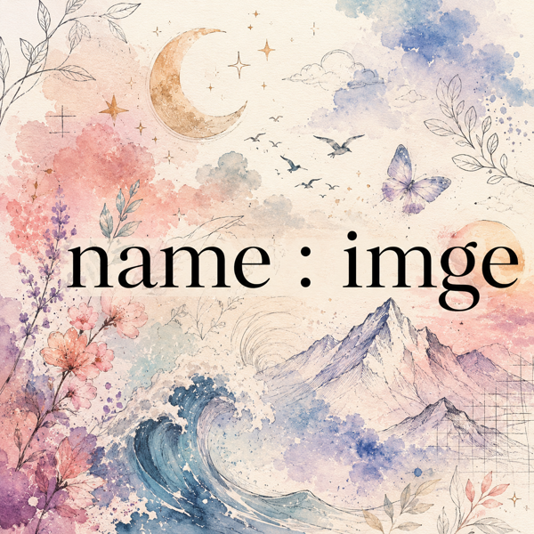
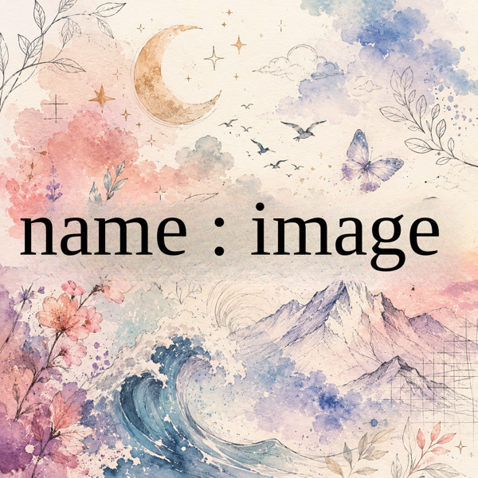
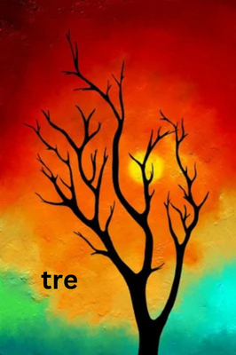
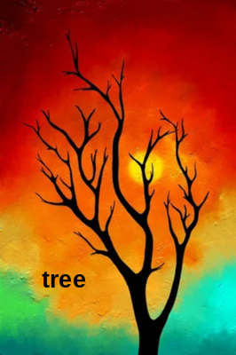

# Image Text Editor + Advanced Text Replacer

A local, end-to-end tool that **erases text from images, reconstructs the
background behind it with AI, and re-types new text in the same font, color,
size, and position** — so the result looks native, not pasted on.

Two ways to use it:

1. **Web UI** — a 5-step wizard (upload → mask → inpaint → add text → save).
2. **Advanced CLI** (`advanced_replace.py`) — fully automatic batch mode that
   scans a folder, auto-detects every text region, and replaces it.

Built and tested on **Linux + NVIDIA RTX 5050** (Blackwell, CUDA 12.8+).
Runs on CPU too, just slower.

---

## Example — fixing a typo in artwork

Original text had a typo (**"imge"**). The tool erased it, rebuilt the
watercolor behind it, and re-typed **"image"** in a matching serif at the same
position — so the fix is invisible:

| Before | After |
| ------ | ----- |
|  |  |

The text region was **located automatically by AI** (the solid-ink projection
detector, robust to busy watercolor backgrounds — no manual boxing), then
re-typed in a matching light serif. Produced with:

```bash
python app/fix_one.py before.png "name : image" --font "Liberation Serif"
```

> **Note on fonts:** the original image here was itself **AI-generated**, so the
> text isn't set in any real, installed font — it only *looks* like a serif.
> Because that exact typeface doesn't exist as a file on disk, the tool can't
> reproduce it perfectly; it estimates the closest match (here a light serif,
> `Liberation Serif`). For pixel-perfect matching you need the actual font
> installed, or override it with `--font`.

### Example 2 — Stable Diffusion inpainting (remove only the text)

A second fix (**"tre" → "tree"**) using the **SD 1.5 inpainting** model instead
of MAT. SD *regenerates* plausible background inside the mask, so the painted
sunset is rebuilt where the text was. Crucially, only the **text** is masked —
the tree, the sun, and the rest of the painting are left completely untouched
(nothing else is removed).

| Before | After |
| ------ | ----- |
|  |  |

```bash
# Start IOPaint with the SD inpainting model (see SD setup below), then:
python app/fix_one.py tre.png "tree" \
    --bbox 47,306,100,326 --mask-bbox 40,300,95,332 \
    --model "sd-v1-5-inpainting.ckpt" \
    --prompt "orange and teal painted sunset sky, smooth brush texture, no text" \
    --font "Liberation Sans" --bold
```

- `--mask-bbox` covers **only** the old text (kept clear of the tree), so SD
  rebuilds just that patch — nothing else changes.
- The negative prompt (`text, letters, words…`, built in) tells SD *not* to
  paint any text back in.
- This source is AI-generated too, so the same font caveat applies — the new
  word uses a close match (`Liberation Sans` bold).

---

## How it works

```
 ┌──────────┐   ┌───────────────┐   ┌────────────┐   ┌───────────────┐   ┌──────────┐
 │  Detect  │ → │  Mask + Erase │ → │  Estimate  │ → │  Render new   │ → │  Blend   │
 │  text    │   │  (inpaint bg) │   │  font/size │   │  text in place│   │  + save  │
 └──────────┘   └───────────────┘   └────────────┘   └───────────────┘   └──────────┘
   solid-ink +     IOPaint MAT         OpenCV +          Pillow, fit to       feather +
   Groq OCR        / MAT / ZITS        Groq vision       original bbox        brightness
```

---

## 1. Prerequisites — what to install and WHERE

> **TL;DR:** run `./install.sh` once. It creates the virtual-environments and
> downloads the models into the right folders automatically. The sections below
> explain what it puts where, so you can fix things by hand if a download fails.

### a) System packages
Python 3.10+, git, and the OpenCV runtime libraries + fonts:

```bash
sudo apt install python3 python3-venv python3-pip git \
                 libgl1 libglib2.0-0 \
                 fonts-liberation fonts-dejavu fonts-noto
```

The `fonts-*` packages matter: font matching maps detected fonts (Arial,
Helvetica, Times…) onto installed equivalents (Liberation Sans, DejaVu Serif…).
More fonts installed = better visual matches.

### b) Python environments (3 separate venvs — keep them isolated)

| venv | Where | What it holds |
| ---- | ----- | ------------- |
| `venv_iopaint/` | project root | IOPaint + PyTorch (the inpainting server) |
| `venv_app/`     | project root | Flask app + Pillow + OpenCV + Groq client |
| `ComfyUI/venv/` | inside ComfyUI | ComfyUI's own deps (optional engine) |

`./install.sh` builds all three. **RTX 50-series note:** Blackwell GPUs need the
**PyTorch nightly cu128** build — the installer detects this; if CUDA breaks
later run `./setup/fix_rtx50.sh`.

### c) Models — what to download and exactly where they go

| Model | Size | Where it must live | How it gets there | Needed for |
| ----- | ---- | ------------------ | ----------------- | ---------- |
| **MAT** | ~700 MB | `models/iopaint_cache/` | auto-downloaded by IOPaint on first run | **Default.** Sharper reconstruction on textured / busy backgrounds |
| **LaMa** | ~200 MB | `models/iopaint_cache/` | auto-downloaded on first use | Faster, but blurrier on detailed textures |
| **ZITS** | ~400 MB | `models/iopaint_cache/` | auto-downloaded on first use | Thin strokes, fine detail |
| **SD 1.5 inpainting** | ~4 GB | `models/checkpoints/sd-v1-5-inpainting.ckpt` | `./setup/download_models.sh` | Optional — full background *regeneration* via ComfyUI / SD engine |

Key points:
- **You don't need to hand-download LaMa/MAT/ZITS** — IOPaint pulls them into
  `models/iopaint_cache/` the first time you select that model. Just be online.
- **SD 1.5 is optional.** Only needed if you pick the "SD Inpainting" or
  "ComfyUI" engine. LaMa alone is enough for normal text replacement.
- ComfyUI's `models/checkpoints/` is symlinked to the project's
  `models/checkpoints/`, so both share the one 4 GB file (no duplication).

### d) Groq API key (optional but recommended)
Powers vision-based font identification + OCR of the original text.

```bash
cp .env.example .env
# then edit .env and paste your key from https://console.groq.com/keys
```

Without a key the tool still runs — it just falls back to local OpenCV
heuristics for font/size/color and skips OCR of the original text.

---

## 2. Run

```bash
./run.sh           # starts IOPaint (:8080), ComfyUI (:8188), Flask UI (:5000)
```

Then open **http://localhost:5000**.

Pick the IOPaint model at launch:

```bash
IOPAINT_MODEL=mat  ./run.sh   # default — sharper on textured backgrounds
IOPAINT_MODEL=lama ./run.sh   # faster, but blurrier on detail
IOPAINT_MODEL=zits ./run.sh   # thin strokes / fine details
```

Stop everything: `./stop.sh`

### Using the SD 1.5 inpainting model (Example 2)

For *generative* background reconstruction (regenerates texture instead of
extending neighbours), use the local SD 1.5 inpainting checkpoint. IOPaint
discovers single-file checkpoints under
`models/iopaint_cache/stable_diffusion/`, so point it there once:

```bash
# 1. Get the checkpoint (≈4 GB) — downloads to models/checkpoints/
./setup/download_models.sh

# 2. Make IOPaint see it as a single-file SD model
mkdir -p models/iopaint_cache/stable_diffusion
ln -sf "$PWD/models/checkpoints/sd-v1-5-inpainting.ckpt" \
       models/iopaint_cache/stable_diffusion/

# 3. Start IOPaint on that model
IOPAINT_MODEL=sd-v1-5-inpainting.ckpt ./run.sh
```

SD is **slower** than MAT/LaMa (it denoises ~40 steps per region) but rebuilds
detailed/painted backgrounds best. It needs a GPU with enough VRAM; on CPU it's
very slow.

---

## 3. Two ways to use it

### A) Web UI (guided, http://localhost:5000)

| Step | What you do |
| ---- | ----------- |
| **1 Upload** | Drag in an image (PNG/JPG/WEBP/BMP/TIFF). |
| **2 Mask**   | Brush over text to erase — or click **🔍 Auto-Detect Text** to box it automatically. |
| **3 Inpaint**| AI reconstructs the background behind the text. |
| **4 Add Text**| The original font/size/color/position are pre-filled. Type the replacement; it auto-fits the original bounding box. |
| **5 Save**   | Writes to `output/`, with original ↔ inpainted ↔ final compare. |

### B) Advanced CLI — automatic batch replace

Processes **every image in a folder** (default `~/Desktop`), auto-detects all
text, replaces it, and writes a `*_edited.png` next to each original plus a JSON
log.

```bash
source venv_app/bin/activate

# Replace ALL detected text with one string, across ~/Desktop
python advanced_replace.py "HELLO WORLD"

# Different source folder + inpaint model
python advanced_replace.py "NEW TEXT" --folder ~/Pictures --model mat

# Per-phrase mapping (find → replace)
python advanced_replace.py --map '{"Hello":"Hola","World":"Mundo"}'

# Manual style override if auto-detect is off
python advanced_replace.py "RED BIG" --color "#FF0000" --font-size 72

# Preview which files would be processed — change nothing
python advanced_replace.py "X" --dry-run
```

**Output:**
- `~/Desktop/yourfile_edited.png` — processed image (original kept untouched)
- `~/Desktop/text_replacement_log.json` — per-file success/failure + per-region
  detected font, size, color, and replacement status

### Tips

**Single-region typo fixes.** To correct one known piece of text (like the
example above) use the targeted helper. It auto-detects the text region, or you
can pass an explicit box:

```bash
source venv_app/bin/activate

# Auto-detect the text region, fix it, keep everything else untouched:
python app/fix_one.py ~/Desktop/poster.png "name : image"

# Give the exact box + force a font if the typeface is misread:
python app/fix_one.py ~/Desktop/poster.png "name : image" \
    --bbox 55,534,1215,758 --font "Liberation Serif"
```

**Font matching.** The font *sampler* (serif-vs-sans, family) can still misread
ornate text — override the typeface with `--font "..."` / `--bold` (CLI) or the
Step-4 controls (UI). Weight (Regular/Bold/Italic) is now selected from the
correct font face, so non-bold text renders light as expected. Install more
font packages for better family matches.

---

## 4. Working with this repo on GitHub

### Clone it
```bash
git clone https://github.com/<your-username>/image-text-editor.git
cd image-text-editor
cp .env.example .env      # then add your Groq key
./install.sh
```

> The big stuff (`venv_*/`, `models/`, `ComfyUI/`, `temp/`, `output/`) is
> **gitignored** — it's regenerated by `./install.sh`, not stored in git. A fresh
> clone is small; the first `./install.sh` + `./run.sh` pulls the models down.

### Day-to-day git flow
```bash
git checkout -b my-change      # branch for your work
# ...edit files...
git add app/auto_detector.py   # stage specific files (avoid `git add .`)
git commit -m "Fix MSER kwargs for OpenCV 4.7+"
git push -u origin my-change
gh pr create                   # open a pull request (needs gh — see below)
```

### Using `gh` (the GitHub CLI / "GitHub skill")
[`gh`](https://cli.github.com/) is the official GitHub CLI — it's what lets the
agent (and you) create repos, push, and open PRs from the terminal.

```bash
# one-time login (interactive, opens browser or device code)
gh auth login

# common commands
gh repo create image-text-editor --public --source=. --remote=origin
gh repo view --web         # open this repo in a browser
gh pr create               # open a PR from the current branch
gh pr status               # see your PRs and their checks
gh pr checks               # CI status for the current PR
```

Inside **Claude Code**, the `/review` skill reviews a pull request and
`/security-review` scans a diff for vulnerabilities — handy before merging.

### Doc co-authoring
Commits made collaboratively (e.g. with an AI assistant) should record both
authors using a `Co-Authored-By` trailer in the commit message:

```bash
git commit -m "$(cat <<'EOF'
Add advanced batch text replacement CLI

Co-Authored-By: Claude <noreply@anthropic.com>
EOF
)"
```

GitHub renders every `Co-Authored-By:` line as an extra avatar on the commit,
so credit is shared. Keep one trailer per co-author, after a blank line at the
end of the message. The same applies when two people pair on the README or any
doc — list each contributor on its own `Co-Authored-By:` line.

---

## 5. Project layout

```
image-text-editor/
├── install.sh / run.sh / stop.sh   # lifecycle scripts
├── advanced_replace.py             # ← automatic batch CLI
├── .env.example                    # copy to .env, add Groq key
│
├── app/                            # Flask backend + frontend
│   ├── app.py                      # routes: upload, inpaint, add-text, batch, save
│   ├── auto_detector.py            # MSER text-region detection
│   ├── batch_processor.py          # folder pipeline + logging
│   ├── font_sampler.py             # font/size/color estimate (OpenCV + Groq)
│   ├── text_overlay.py             # Pillow renderer (fit-to-bbox, stroke, blend)
│   ├── inpaint.py                  # IOPaint HTTP client
│   ├── comfyui_client.py           # ComfyUI API client
│   └── templates/ + static/        # wizard UI (HTML/CSS/JS)
│
├── setup/                          # installers + RTX 50 fix
├── workflows/sd_inpaint.json       # ComfyUI SD-inpainting graph
│
├── ComfyUI/        # ← gitignored, created by install.sh
├── venv_iopaint/   # ← gitignored
├── venv_app/       # ← gitignored
├── models/         # ← gitignored: checkpoints/ + iopaint_cache/
├── input/ output/ temp/   # ← gitignored working dirs
```

---

## 6. Troubleshooting

| Symptom | Fix |
| ------- | --- |
| `torch.cuda.is_available()` is False on RTX 5050 | `./setup/fix_rtx50.sh` (PyTorch nightly cu128) |
| `'_delta' is an invalid keyword for MSER_create()` | OpenCV ≥ 4.7 API change — already handled in `auto_detector.py`; update if you see it |
| IOPaint status dot stays red | `tail -f temp/iopaint.log`; first run downloads the model — wait for it |
| "Inpainting failed: connection refused" | IOPaint not up yet — `./run.sh` and wait for the ready line |
| Model download fails | Hugging Face throttling — re-run `./setup/download_models.sh` |
| Replacement text is the wrong size | Use the UI Step-4 controls, or CLI `--font-size` / `--color` to override auto-detect |
| Groq font/OCR not working | Check `GROQ_API_KEY` in `.env`; without it, local heuristics are used |
| Out of VRAM on SD inpainting | Use `lama` instead of `sd-inpainting`, or lower steps in `inpaint.py` |

---

## License

Personal / educational. Bundled tools keep their own licenses:
ComfyUI (GPLv3), IOPaint (Apache 2.0), SD 1.5 Inpainting (RunwayML license).
